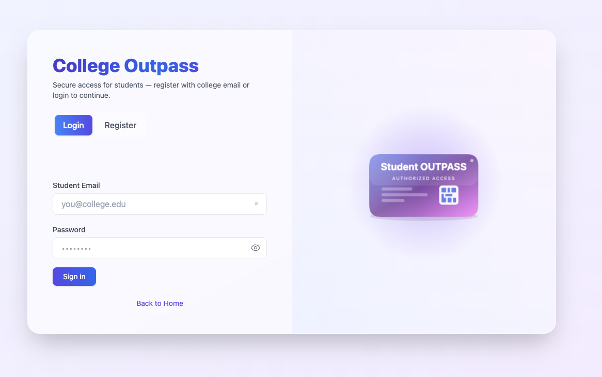
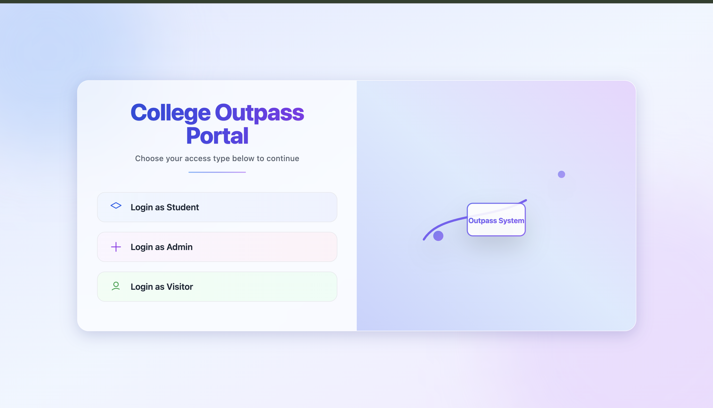
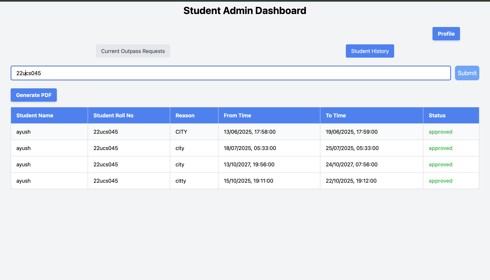
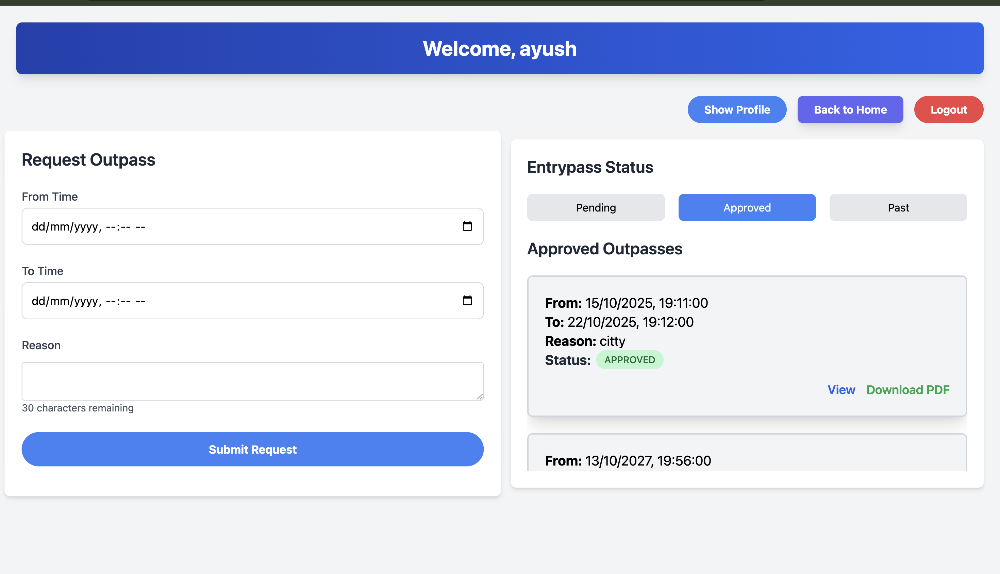
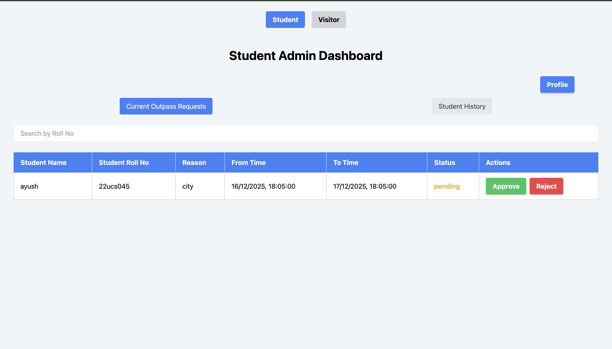

Here are some images from the project:

1. 
3. 
6. 
7. 
8. 

# Outpass Management System

A comprehensive digital outpass management system for educational institutions, enabling students and visitors to request permissions for leaving campus, with an admin approval workflow.


---

## 📋 Overview

The Outpass Management System replaces traditional paper-based permission slips with a modern web application. Students and visitors can request outpasses digitally, while administrators can review and approve/reject requests in real-time. The system maintains a complete history of all requests with timestamped records.

---

## ✨ Features

### For Students
- 🔐 **Secure Registration** - OTP-based email verification
- 📝 **Request Outpass** - Submit requests with reason and time range
- ⏱️ **Overlap Prevention** - Client-side validation prevents double-booking
- 📊 **Request History** - View all past outpasses with status tracking
- 📄 **PDF Generation** - Download outpass details as PDF documents
- 🔔 **Status Tracking** - Monitor pending, approved, and rejected requests

### For Visitors
- 🎫 **Guest Registration** - Separate workflow for non-students
- 📱 **Contact Information** - Maintain visitor records with phone numbers
- 🚪 **Entry Pass Requests** - Request temporary campus access

### For Administrators
- 👥 **Unified Dashboard** - Manage both student and visitor requests
- ✅ **Quick Approval** - One-click approve/reject actions
- 🔍 **Detailed View** - See requester information with populated data
- 📈 **Request Overview** - View all pending requests at a glance

---

## 🛠️ Tech Stack

### Frontend
- **React 18.3.1** - UI framework
- **React Router 6.26** - Client-side routing
- **Tailwind CSS 3.4** - Styling framework
- **Axios 1.7** - HTTP client
- **jsPDF** - PDF generation
- **React Modal** - Modal dialogs

### Backend
- **Node.js** - Runtime environment
- **Express 4.19** - Web framework
- **MongoDB** - NoSQL database
- **Mongoose 8.6** - ODM for MongoDB
- **JWT** - Authentication tokens
- **Bcrypt** - Password hashing
- **Nodemailer** - Email service for OTP

---

## 🚀 Quick Start

### Prerequisites
- Node.js (v14 or higher)
- MongoDB (local or Atlas)
- Gmail account (for OTP emails)

### Installation

1. **Clone the repository**
   ```bash
   git clone https://github.com/ayush121314/Outpass.git
   cd Outpass
   ```

2. **Backend Setup**
   ```bash
   cd backend
   npm install
   ```

   Create `.env` file:
   ```env
   PORT=5000
   MONGO_URI=your_mongodb_connection_string
   JWT_SECRET=your_jwt_secret_key
   EMAIL_USER=your_gmail@gmail.com
   EMAIL_PASS=your_gmail_app_password
   ```

   Start backend:
   ```bash
   npm start
   ```

3. **Frontend Setup**
   ```bash
   cd frontend
   npm install
   ```

   Create `.env` file:
   ```env
   REACT_APP_API_URL=http://localhost:5000
   ```

   Start frontend:
   ```bash
   npm start
   ```

4. **Access the application**
   - Frontend: `http://localhost:3000`
   - Backend API: `http://localhost:5000`

---

## 📚 Documentation

Comprehensive documentation is available in the following files:

- **[PROJECT_OVERVIEW.md](./PROJECT_OVERVIEW.md)** - High-level introduction in simple terms
- **[INTERVIEW_GUIDE.md](./INTERVIEW_GUIDE.md)** - Technical interview preparation guide
- **[TECHNICAL_DEEP_DIVE.md](./TECHNICAL_DEEP_DIVE.md)** - Exhaustive technical analysis
- **[END_TO_END_FLOWS.md](./END_TO_END_FLOWS.md)** - Line-by-line feature flow documentation

---

## 🔑 Admin Access

For admin login, use the following credentials (as configured in the backend):
- **Email:** `admin1@gmail.com`
- **Password:** `admin1password`

*Note: These are hardcoded credentials for demo purposes. Update in production.*

---


## 🏗️ Project Structure

```
Outpass/
├── backend/
│   ├── config/          # Database configuration
│   ├── controllers/     # Request handlers
│   ├── middlewares/     # Auth & validation
│   ├── models/          # MongoDB schemas
│   ├── routes/          # API endpoints
│   ├── utils/           # Helper functions
│   └── index.js         # Entry point
├── frontend/
│   ├── public/          # Static files
│   └── src/
│       ├── Components/  # React components
│       ├── context/     # Global state
│       └── App.js       # Main component
└── images/              # Screenshots
```

---

## 🔒 Security Features

- **Password Hashing** - Bcrypt with 10 salt rounds
- **JWT Authentication** - Stateless token-based auth
- **OTP Verification** - Email-based 2FA for registration
- **Input Validation** - Both client and server-side
- **CORS Protection** - Configured allowed origins
- **Email Enumeration Prevention** - Generic error messages

---

## 🚧 Known Limitations

- JWT tokens don't expire (requires implementation)
- No WebSocket for real-time updates (requires page refresh)
- Admin endpoint lacks authentication middleware
- No transaction support for concurrent updates

---

## 🤝 Contributing

Contributions are welcome! Please feel free to submit a Pull Request.

---

---

## 👨‍💻 Author

**Ayush Singh Chauhan**
- GitHub: [@ayush121314](https://github.com/ayush121314)

---

## 🙏 Acknowledgments

- Built with the MERN stack
- UI inspired by modern design principles
- Email service powered by Nodemailer
